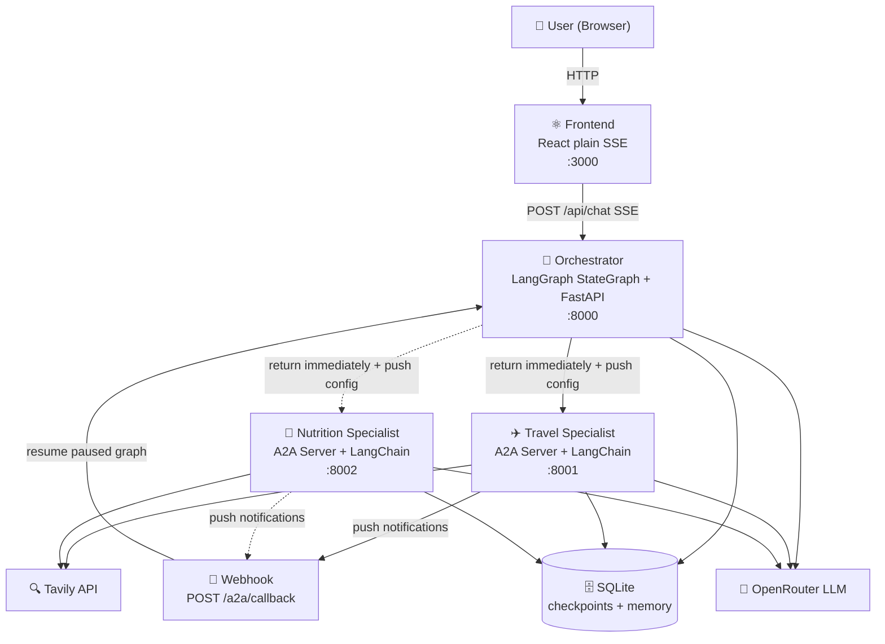
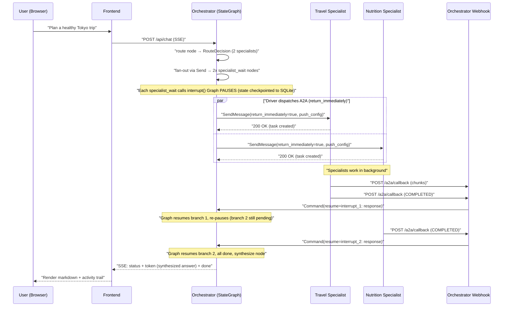
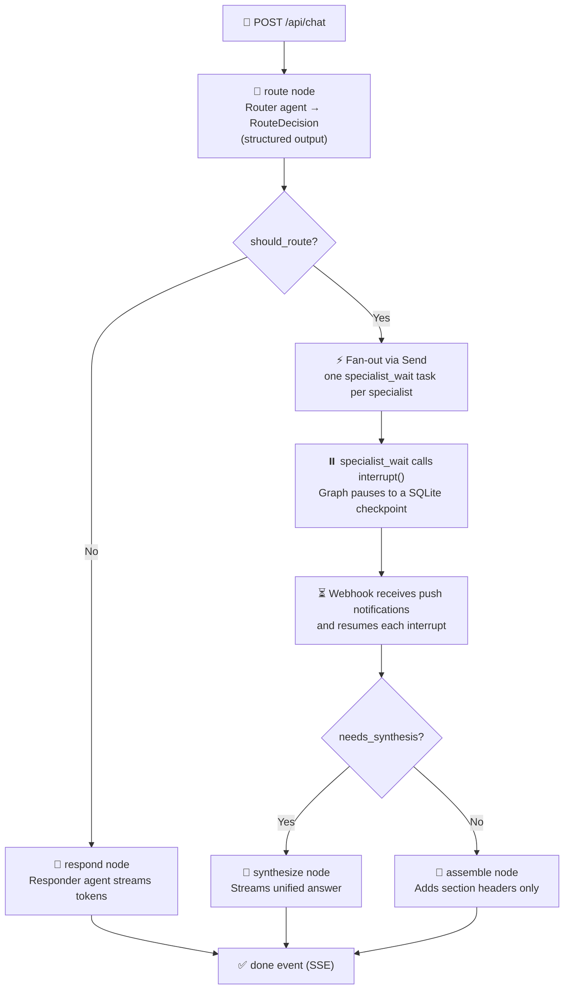
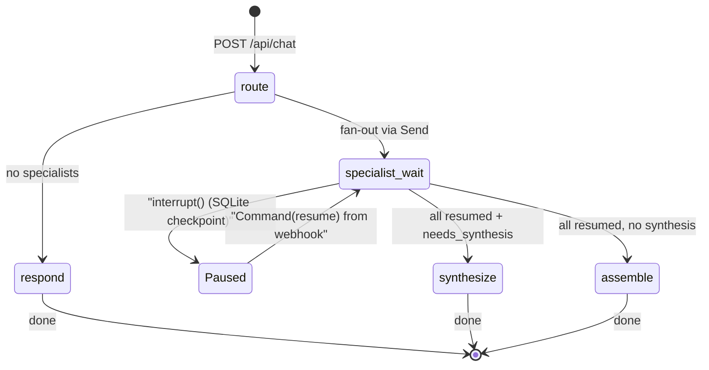
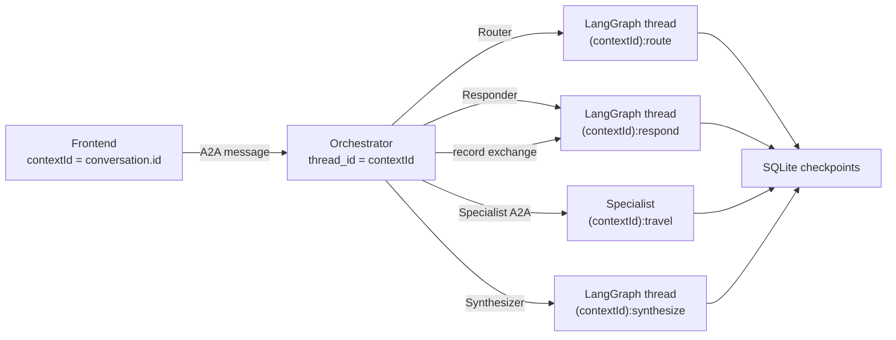
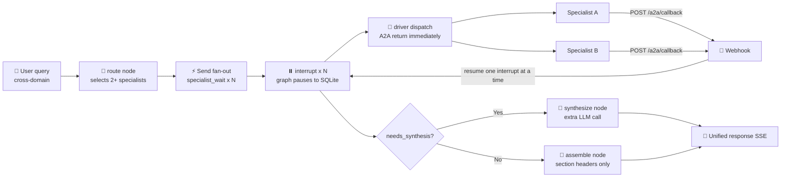

# Nimbus Chat

> A multi-agent chat workspace powered by the **A2A (Agent-to-Agent) protocol**, LangChain `create_agent`, LangGraph checkpointing, and an elegant ChatGPT-style UI with Kimi-inspired streaming.

Nimbus Chat demonstrates an **orchestrator-specialist architecture** where a central orchestrator agent receives user messages, decides which specialist(s) to involve (using structured LLM routing), and either responds directly or **fans out to multiple specialists in parallel**, synthesizing their combined expertise into a single coherent response.

---

## ✨ Features

- **A2A Protocol Native** — Orchestrator and specialists communicate via the A2A JSON-RPC protocol with streaming SSE, agent cards, and task lifecycle management.
- **Parallel Fan-Out** — When a query spans multiple domains (e.g. travel + nutrition), the orchestrator calls all relevant specialists concurrently and synthesizes a unified response.
- **Specialist Agents** — Travel Planner and Nutritionist, each with domain-specific LangChain tools (Tavily web search), system prompts, and skills.
- **Conversation Continuity** — Threaded sessions with LangGraph SQLite checkpointing; the orchestrator remembers specialist-routed turns across direct follow-ups.
- **Streaming UI** — Real-time token streaming with an inline "thinking/activity" trail (Kimi-style), markdown rendering, and per-specialist attribution.
- **OpenRouter + Tavily** — LLM via OpenRouter (`init_chat_model`), web research via Tavily — both configurable through environment variables.
- **Distributed Tracing** — Every request across the orchestrator and all specialists is traced into a single HoneyHive session (LangChain auto-instrumented, W3C context propagation across A2A delegations). See [docs/tracing.md](docs/tracing.md).

---

## 🏗️ Architecture



### How it works

The orchestrator is a **LangGraph StateGraph** (checkpointed to SQLite). It uses **interrupts** to pause while specialists work, and the A2A **push-notification** pattern to receive specialist results asynchronously.



### Routing decision flow



---

## 🚀 Quick Start

### Prerequisites

- [Docker](https://docs.docker.com/get-docker/) + Docker Compose
- An [OpenRouter](https://openrouter.ai/) API key (for the LLM)
- A [Tavily](https://tavily.com/) API key (for web research, optional but recommended)

### 1. Clone & configure

```bash
git clone https://github.com/chandra447/nimbus-chat.git
cd nimbus-chat
cp .env.example .env
```

Edit `.env` and set:
```env
OPENROUTER_API_KEY=sk-or-v1-...       # Required — powers all LLM calls
TAVILY_API_KEY=tvly-...                # Recommended — web research for specialists
TAVILY_ENABLED=true                    # Enable Tavily tools
```

### 2. Launch

```bash
docker compose up --build
```

### 3. Register specialists

Open `http://localhost:3000`, click the **specialists badge** (top-right), and register:

| Specialist | URL |
|---|---|
| Nimbus Travel Planner | `http://localhost:8001` |
| Nimbus Nutritionist | `http://localhost:8002` |

### 4. Chat!

Try these prompts:

- **Travel:** *"Plan a 4-day Tokyo itinerary under $1,500"* → routes to Travel Planner
- **Nutrition:** *"Create a high-protein vegetarian meal plan for muscle gain"* → routes to Nutritionist
- **Cross-domain:** *"I'm traveling to Tokyo for 5 days. Plan my sightseeing AND a healthy high-protein meal plan"* → **parallel fan-out** to both specialists + synthesis

---

## 📁 Project Structure

```
nimbus-chat/
├── docker-compose.yml              # 4-service orchestration
├── .env.example                    # Environment template
│
├── frontend/                       # React + TypeScript + Vite
│   ├── src/
│   │   ├── routes/home-page.tsx    # Main chat UI (Kimi-style streaming)
│   │   ├── lib/chat-stream.ts     # Plain SSE client (POST /api/chat + event parser)
│   │   └── lib/orchestrator-api.ts # Specialist management REST calls
│   └── Dockerfile                  # Multi-stage: node build → nginx serve
│
├── backend/
│   ├── main.py                     # Orchestrator entrypoint (:8000)
│   ├── specialist_main.py          # Specialist entrypoint (:8001/:8002)
│   │
│   ├── app/
│   │   ├── settings.py             # Pydantic settings (env-driven)
│   │   ├── llm.py                  # init_chat_model("openrouter:...")
│   │   ├── checkpointing.py        # LangGraph AsyncSqliteSaver
│   │   │
│   │   ├── orchestrator/
│   │   │   ├── service.py          # FastAPI app: POST /api/chat (SSE) + webhook + REST + CORS
│   │   │   ├── graph.py            # LangGraph StateGraph (route/respond/specialist_wait/synthesize/assemble)
│   │   │   ├── session.py          # GraphSession driver loop + SessionRegistry (interrupt↔push bridge)
│   │   │   ├── routing.py          # Router, Responder, Synthesizer agents
│   │   │   ├── registry.py         # Specialist registry (SQLite + agent-card fetch)
│   │   │   ├── middleware.py       # Specialist prompt injection middleware
│   │   │   ├── api.py              # REST API (register/refresh/list specialists)
│   │   │   ├── models.py           # Pydantic models for specialist records
│   │   │   └── agent_card.py       # Orchestrator's own A2A agent card
│   │   │
│   │   └── specialist/
│   │       ├── builder.py          # Generic specialist framework (config + executor + card)
│   │       ├── configs.py          # Travel + Nutrition specialist configs
│   │       ├── service.py          # FastAPI app factory for any specialist
│   │       └── agent_card.py       # (Legacy) travel agent card builder
│   │
│   └── Dockerfile                  # Python 3.13 + uv
│
└── docs/                           # Detailed documentation
    ├── architecture.md
    ├── a2a-protocol.md
    ├── specialists.md
    └── development.md
```

---

## 🔧 Configuration

### Environment Variables

| Variable | Default | Description |
|---|---|---|
| `OPENROUTER_API_KEY` | *(none)* | **Required.** API key for OpenRouter LLM. |
| `OPENAI_API_KEY` | *(none)* | Fallback OpenAI key (unused if OpenRouter set). |
| `OPENAI_MODEL` | `gpt-5.4-mini` | Fallback model name. |
| `TAVILY_ENABLED` | `true` | Enable Tavily web search tools. |
| `TAVILY_API_KEY` | *(none)* | Tavily API key for web research. |
| `SPECIALIST_TYPE` | `travel` | Which specialist config to run (`travel` / `nutrition`). |
| `SPECIALIST_PORT` | `8001` | Port the specialist listens on. |
| `SPECIALIST_PUBLIC_URL` | `http://localhost:8001` | URL the frontend uses to register. |
| `SPECIALIST_INTERNAL_URL` | `http://travel-specialist:8001` | Docker-internal URL for orchestrator→specialist. |
| `SPECIALIST_URL_REMAPS` | *(see compose)* | Maps public→internal URLs for multi-specialist routing. |
| `SPECIALIST_CARD_REFRESH_TTL_SECONDS` | `300` | Agent-card cache TTL. `0` = always refresh, `-1` = never. |
| `ORCHESTRATOR_INTERNAL_URL` | `http://localhost:8000` | Internal URL that specialists use to POST push notifications back. |
| `CORS_ORIGINS` | `*` | Comma-separated allowed origins. |
| `VITE_ORCHESTRATOR_BASE_URL` | `http://localhost:8000` | Frontend → orchestrator URL. |
| `HH_API_KEY` | *(none)* | HoneyHive API key. Set to enable distributed tracing. |
| `HH_PROJECT` | *(inferred)* | HoneyHive project name. |
| `HH_ENABLE_TRACING` | `true` | Explicit on/off (defaults on when `HH_API_KEY` set). |
| `OTEL_INSTRUMENTATION_A2A_SDK_ENABLED` | `false` | Disables A2A's own tracing — only LangChain traces go to HoneyHive. |

### LLM Model

The backend uses `init_chat_model("openrouter:deepseek/deepseek-v4-flash")`. To change the model, edit `backend/app/llm.py`:

```python
chat_model = init_chat_model(model="openrouter:anthropic/claude-3.5-sonnet")
```

---

## 📚 How A2A Works in Nimbus Chat

The **A2A (Agent-to-Agent) protocol** defines how agents discover each other and exchange messages. Here's how Nimbus Chat uses it:

### Agent Discovery (Agent Cards)

Every A2A agent exposes a **card** at `/.well-known/agent-card.json` describing its name, skills, capabilities, and protocol endpoints:

```json
{
  "name": "Nimbus Travel Planner",
  "description": "A travel-planning specialist...",
  "capabilities": { "streaming": true },
  "supported_interfaces": [
    { "url": "http://travel-specialist:8001/a2a/jsonrpc", "protocol_binding": "JSONRPC" },
    { "url": "http://travel-specialist:8001/a2a", "protocol_binding": "HTTP+JSON" }
  ],
  "skills": [
    { "id": "itinerary_creation", "name": "Itinerary creation", "tags": ["travel"], "examples": [...] }
  ]
}
```

When a specialist is registered, the orchestrator fetches its card, persists it to SQLite, and injects the skills/examples into the router's system prompt via `RegisteredSpecialistPromptMiddleware`.

### Message Flow (SSE Streaming)

The frontend is a normal React app (no A2A SDK). It POSTs `{ message, context_id }` to `/api/chat` and consumes a Server-Sent Events stream of JSON events emitted by the LangGraph driver:

```mermaid
sequenceDiagram
    participant C as Frontend (plain fetch)
    participant O as Orchestrator (StateGraph)

    C->>O: "POST /api/chat"
    O-->>C: "SSE stream opens"
    O-->>C: "status: routing"
    O-->>C: "status: route_decision (specialists selected)"
    O-->>C: "status: specialist_working"
    O-->>C: "specialist_chunk (live, via push)"
    Note over O: "graph paused at interrupts; webhook resumes"
    O-->>C: "status: synthesizing"
    O-->>C: "token: streamed markdown"
    O-->>C: "done: final response"
    O-->>C: "SSE stream closes"
```

Event types: `status` (phase/lifecycle), `token` (main-response chunks), `specialist_chunk` (raw specialist output, live), `done` (terminal), `error`.

### Graph Lifecycle



---

## 🧬 Conversation Continuity

Each conversation has a stable `contextId` (UUID) generated by the frontend. This ID flows through the entire stack:



When a specialist responds, the orchestrator calls `responder.record_exchange()` to inject the user message + specialist response into the responder's LangGraph thread (via `aupdate_state` with `as_node='model'`). This ensures **cross-path continuity**: a direct follow-up after a specialist-routed turn still has full context.

---

## ⚡ Parallel Fan-Out: LangGraph Interrupts + A2A Push Notifications

When the router selects multiple specialists, the orchestrator combines **two async patterns**:

1. **LangGraph interrupts** — the graph fans out via `Send` to one `specialist_wait` node per specialist. Each calls `interrupt()` → the graph **pauses** (state checkpointed to SQLite) with **multiple interrupts**. As each specialist completes, its interrupt is resumed individually (`Command(resume={interrupt_id: response})`); the graph re-pauses until all are done, then proceeds to synthesize/assemble.

2. **A2A push notifications** — the driver sends `SendMessage(return_immediately=True)` with a push config pointing to `/a2a/callback`. Specialists work in the background and POST status/artifact events to the webhook. No long-held SSE connections to specialists.



1. **route node** returns `RouteDecision` with `specialists: [...]` and `needs_synthesis: bool`
2. The graph fans out via `Send` — one `specialist_wait` task per specialist. Each calls `interrupt()` (pure, no side effects) → **graph pauses with N interrupts**
3. The **driver** (session.py) detects the pause, and for each interrupt sends `SendMessage(return_immediately=True)` with a `TaskPushNotificationConfig` pointing to `/a2a/callback`
4. Specialists process in the background and **POST push notifications** (status + artifact chunks) to the webhook. Chunks are relayed live to the frontend activity trail
5. On each specialist's terminal status, the webhook pushes `Command(resume={interrupt_id: response})` — the graph resumes that branch and **re-pauses** if others are still pending (partial resume of multiple interrupts)
6. When all interrupts are resumed:
   - **`needs_synthesis=true`** → `synthesize` node (Synthesizer agent streams a unified answer)
   - **`needs_synthesis=false`** → `assemble` node (section headers, **no extra LLM call**)
7. The response is recorded in the responder's thread for conversation continuity

> **Why this is elegant:** the LangGraph checkpointer makes the pause **durable** (survives restarts), the interrupt/resume mechanism is the graph's native HITL primitive, and A2A push notifications provide the network-level async delivery. The frontend just consumes one SSE stream.

---

## ➕ Adding a New Specialist

1. **Add a config** in `backend/app/specialist/configs.py`:

```python
fitness_config = SpecialistConfig(
    name='Nimbus Fitness Coach',
    description='A fitness specialist for workout plans and exercise guidance.',
    system_prompt='You are Nimbus Fitness Coach...',
    tavily_tool_name='research_fitness',
    tavily_tool_description='Search for current fitness research and exercise science.',
    table_name_prefix='fitness_specialist',
    artifact_name='fitness-plan',
    skills=[
        SpecialistSkillSpec(
            id='workout_planning',
            name='Workout planning',
            description='Creates structured workout routines...',
            tags=['fitness', 'workout'],
            examples=['Create a 4-day hypertrophy split', 'Design a beginner home workout'],
        ),
    ],
)

SPECIALIST_CONFIGS['fitness'] = fitness_config
```

2. **Add a Docker Compose service**:

```yaml
fitness-specialist:
  build:
    context: ./backend
    dockerfile: Dockerfile
  command: ["uv", "run", "python", "specialist_main.py"]
  environment:
    SPECIALIST_TYPE: fitness
    SPECIALIST_PORT: "8003"
    SPECIALIST_PUBLIC_URL: http://localhost:8003
    SPECIALIST_INTERNAL_URL: http://fitness-specialist:8003
    # ... (same as other specialists)
  ports:
    - "8003:8003"
```

3. **Update `SPECIALIST_URL_REMAPS`** in the orchestrator service:

```yaml
SPECIALIST_URL_REMAPS: http://localhost:8001=http://travel-specialist:8001,http://localhost:8002=http://nutrition-specialist:8002,http://localhost:8003=http://fitness-specialist:8003
```

4. **Register** the specialist via the UI at `http://localhost:8003`.

That's it — the router will automatically consider the new specialist for relevant queries.

---

## 📖 Documentation

- [Architecture Deep Dive](docs/architecture.md) — Component breakdown, data flow, and design decisions
- [A2A Protocol Guide](docs/a2a-protocol.md) — How A2A discovery, messaging, and streaming work
- [Specialists Guide](docs/specialists.md) — Building, configuring, and registering specialist agents
- [Development Guide](docs/development.md) — Local development, testing, and debugging
- [Distributed Tracing](docs/tracing.md) — HoneyHive tracing across orchestrator + specialists

---

## 🛠️ Tech Stack

| Layer | Technology |
|---|---|
| **Frontend** | React 19, TypeScript, Vite, Tailwind CSS v4, Framer Motion, react-markdown |
| **Frontend** | React + Vite + Tailwind — plain SSE client (no A2A SDK), `react-markdown`, framer-motion |
| **Backend** | Python 3.13, FastAPI, Pydantic v2, uvicorn |
| **A2A SDK (Python)** | `a2a-sdk` — server routes, task store, event queues, client |
| **LLM Framework** | LangChain `create_agent`, LangGraph (state, checkpointing, streaming) |
| **LLM Provider** | OpenRouter via `init_chat_model("openrouter:...")` |
| **Web Research** | Tavily API (LangChain `@tool` integration) |
| **Persistence** | SQLite (shared Docker volume) — A2A tasks + LangGraph checkpoints + specialist registry |
| **Deployment** | Docker Compose (4 services: orchestrator, travel, nutrition, frontend) |

---

## 📄 License

MIT
