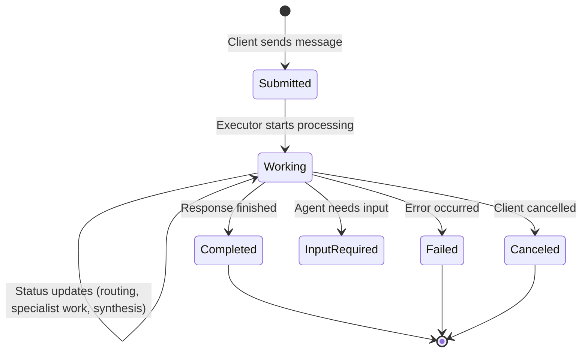
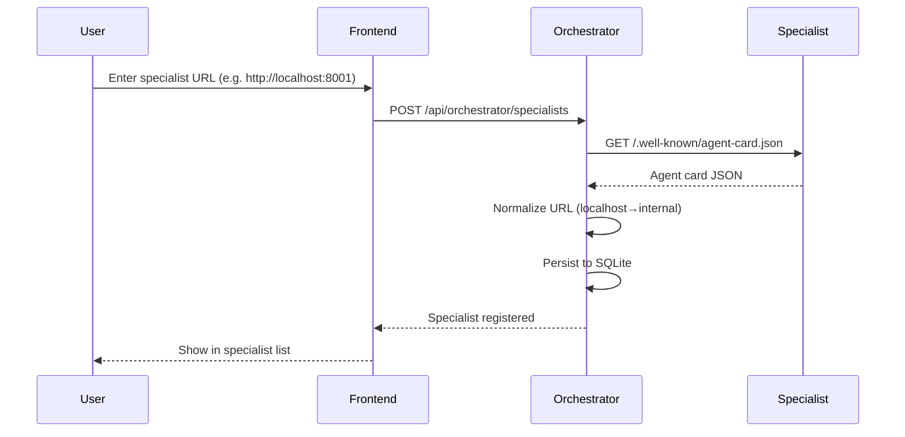

# A2A Protocol Guide

The **Agent-to-Agent (A2A) protocol** is an open standard for agent interoperability. Nimbus Chat uses the A2A Python SDK (`a2a-sdk`) for the **specialists** (which are A2A servers) and for the **orchestrator** (which calls them as an A2A client with `return_immediately=True` + push notifications). The frontend is a normal React app that consumes a plain SSE stream — it does **not** use the A2A SDK.

---

## Core Concepts

### Agent Card

Every A2A agent publishes a machine-readable **agent card** at `/.well-known/agent-card.json`. This is how agents discover each other's capabilities.

```json
{
  "name": "Nimbus Travel Planner",
  "description": "A travel-planning specialist...",
  "version": "0.1.0",
  "capabilities": {
    "streaming": true,
    "push_notifications": false
  },
  "supported_interfaces": [
    {
      "url": "http://travel-specialist:8001/a2a/jsonrpc",
      "protocol_binding": "JSONRPC",
      "protocol_version": "1.0"
    },
    {
      "url": "http://travel-specialist:8001/a2a",
      "protocol_binding": "HTTP+JSON",
      "protocol_version": "1.0"
    }
  ],
  "skills": [
    {
      "id": "itinerary_creation",
      "name": "Itinerary creation",
      "description": "Builds day-by-day itineraries...",
      "tags": ["travel", "itinerary"],
      "examples": ["Plan a 4-day Tokyo itinerary for first-time visitors."]
    }
  ]
}
```

### Protocol Bindings

Nimbus Chat supports two bindings:

| Binding | URL Path | Use Case |
|---|---|---|
| **JSONRPC** | `/a2a/jsonrpc` | Primary — supports streaming via SSE |
| **HTTP+JSON** | `/a2a` | REST fallback — single request/response |

### Task Lifecycle



### Event Types

The A2A streaming protocol emits these event types via SSE:

| Event | Protobuf Field | Description |
|---|---|---|
| **Task** | `task` | Task created with initial state |
| **Status Update** | `status_update` | State transition (working, completed, failed) + optional message |
| **Artifact Update** | `artifact_update` | Streamed response chunk (supports `append` for incremental) |
| **Message** | `message` | Final complete message |

---

## A2A in Nimbus Chat

### Registration Flow



### URL Normalization

The frontend registers specialists using **localhost URLs** (e.g. `http://localhost:8001`), but the orchestrator runs inside Docker and needs **internal service URLs** (e.g. `http://travel-specialist:8001`). The registry handles this via `SPECIALIST_URL_REMAPS`:

```
SPECIALIST_URL_REMAPS=http://localhost:8001=http://travel-specialist:8001,http://localhost:8002=http://nutrition-specialist:8002
```

### Streaming Message Flow

The **frontend is a normal React app** (no A2A SDK). It POSTs to `/api/chat` and consumes a plain SSE stream. A2A is only used **between the orchestrator and specialists** (the orchestrator is an A2A *client*, specialists are A2A *servers*).

```mermaid
sequenceDiagram
    participant F as Frontend (plain fetch)
    participant O as Orchestrator (StateGraph)
    participant S1 as Specialist A (A2A server)
    participant S2 as Specialist B (A2A server)
    participant WH as Webhook

    F->>O: POST /api/chat {message, context_id} (SSE)
    O-->>F: data: status (routing)
    O-->>F: data: status (route_decision: 2 specialists)
    Note over O: graph fans out, specialist_wait × 2 call interrupt()<br/>graph PAUSES (SQLite checkpoint)

    par Driver dispatches A2A
        O->>S1: SendMessage(return_immediately=true, push_config)
        S1-->>O: 200 OK
    and
        O->>S2: SendMessage(return_immediately=true, push_config)
        S2-->>O: 200 OK
    end

    S1->>WH: POST /a2a/callback (chunks)
    WH-->>F: data: specialist_chunk (activity)
    S1->>WH: POST /a2a/callback (COMPLETED)
    WH->>O: Command(resume={interrupt_1: resp1})
    Note over O: branch 1 resumes; re-pauses (branch 2 pending)

    S2->>WH: POST /a2a/callback (COMPLETED)
    WH->>O: Command(resume={interrupt_2: resp2})
    Note over O: branch 2 resumes → all done

    alt needs_synthesis=true
        O-->>F: data: status (synthesizing)
        O-->>F: data: token ... (unified answer)
    else needs_synthesis=false
        O-->>F: data: status (assembling)
        O-->>F: data: token ... (section headers + responses)
    end
    O-->>F: data: done (final_response)
```

### Frontend SSE Client

The frontend consumes the SSE stream with a plain `fetch` + `ReadableStream` parser (see `chat-stream.ts`):

```typescript
import { streamChat } from '@/lib/chat-stream'

for await (const event of streamChat(baseUrl, userMessage, conversationId)) {
  switch (event.type) {
    case 'status':          // phase/lifecycle (routing, working, …)
    case 'token':           // main-response chunk (append to markdown)
    case 'specialist_chunk':// raw specialist chunk (activity trail)
    case 'done':            // terminal
    case 'error':           // failure
  }
}
```

### Specialists: A2A Servers

The specialists remain full A2A servers (using `a2a-sdk`). The `DefaultRequestHandler` ties together the executor, task store, agent card, and push-notification sender:

```python
request_handler = DefaultRequestHandler(
    agent_executor=executor,        # GenericSpecialistExecutor
    task_store=DatabaseTaskStore(engine),
    agent_card=agent_card,
    push_config_store=push_config_store,
    push_sender=BasePushNotificationSender(...),  # POSTs StreamResponse to the orchestrator webhook
)
```

The orchestrator calls them as an A2A **client** with `return_immediately=True` + a `TaskPushNotificationConfig` pointing at its own `/a2a/callback` webhook.

---

## Artifact Streaming Details

A2A artifacts support **incremental append**. The first chunk must use `append=False` to create the artifact, and subsequent chunks use `append=True`:

```python
first_chunk = True
async for token in agent.astream_events(...):
    await updater.add_artifact(
        artifact_id=artifact_id,
        name='travel-plan',
        parts=[Part(text=token)],
        append=not first_chunk,  # False for first, True for rest
        last_chunk=False,
    )
    first_chunk = False
```

This allows the frontend to render text as it streams in, rather than waiting for the complete response.

---

## Push Notifications (Async Callback Pattern)

The A2A protocol supports **push notifications** for disconnected/async scenarios. Nimbus Chat uses this pattern for all orchestrator→specialist communication, combined with **LangGraph interrupts** on the orchestrator side.

### How It Works

```mermaid
sequenceDiagram
    participant O as Orchestrator (StateGraph)
    participant D as GraphSession driver
    participant S as Specialist
    participant WH as Webhook /a2a/callback

    Note over O: specialist_wait node calls interrupt()<br/>graph PAUSES (SQLite checkpoint)
    D->>S: SendMessage(return_immediately=true, push_config={url, token})
    S-->>D: 200 OK (initial Task)
    Note over S: Specialist works in background

    loop Background processing
        S->>WH: POST /a2a/callback (StreamResponse JSON)
        Note right of WH: Header: X-A2A-Notification-Token
        WH->>D: handle_push_event(token, event)
        D-->>D: relay specialist_chunk to SSE (activity trail)
    end

    S->>WH: POST /a2a/callback (terminal status)
    WH->>D: resume_queue.put(Command(resume={interrupt_id: response}))
    D->>O: astream(Command(resume=...))
    Note over O: branch resumes; re-pauses if other interrupts pending
```

### Key Components

| Component | File | Role |
|---|---|---|
| `GraphSession` | `app/orchestrator/session.py` | Driver loop: runs graph, dispatches A2A, bridges webhook→`Command(resume)` |
| `SessionRegistry` | `app/orchestrator/session.py` | Maps callback tokens → active sessions (for webhook dispatch) |
| Webhook endpoint | `POST /a2a/callback` on orchestrator | Receives push notifications, relays chunks, resumes graph |
| `BasePushNotificationSender` | A2A SDK (on specialist) | POSTs `StreamResponse` events to the webhook URL |
| `TaskPushNotificationConfig` | A2A proto | Contains `url` + `token` for callbacks |

### Request Configuration

The orchestrator (as A2A client) sends `SendMessage` with:

```python
SendMessageRequest(
    message=Message(...),
    configuration=SendMessageConfiguration(
        return_immediately=True,           # Don't wait for completion
        task_push_notification_config=TaskPushNotificationConfig(
            url=f'{orchestrator_internal_url}/a2a/callback',
            token=callback_token,           # Unique per specialist call
        ),
    ),
)
```

When the specialist reaches a terminal state, the webhook resumes the paused graph interrupt with `Command(resume={interrupt_id: response})`. With multiple specialists, the graph pauses with **multiple interrupts** that are resumed **one at a time** as each specialist posts back (partial resume).

---

## Context IDs and Threading

The A2A `context_id` field is used as the LangGraph `thread_id` across the system:

| Component | Thread ID | Purpose |
|---|---|---|
| **Orchestrator graph** | `{contextId}:orch:{turn_id}` | Per-turn graph state + interrupt checkpoints (isolated per turn) |
| Router agent | `{contextId}:route` | Routing decision history |
| Responder agent | `{contextId}:respond` | Direct response history |
| Synthesizer agent | `{contextId}:synthesize` | Synthesis history |
| Travel specialist | `{contextId}:travel_specialist` | Travel conversation history |
| Nutrition specialist | `{contextId}:nutrition_specialist` | Nutrition conversation history |

The frontend generates a stable UUID per conversation and sends it as `context_id` on every message. This enables multi-turn conversations with full context retention. The orchestrator graph uses a fresh per-turn thread (so each turn's interrupts/state don't bleed into the next), while the nested agents reuse stable thread IDs for memory.
