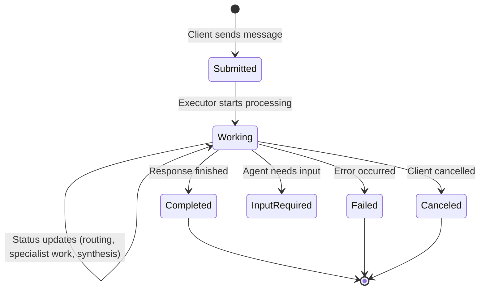
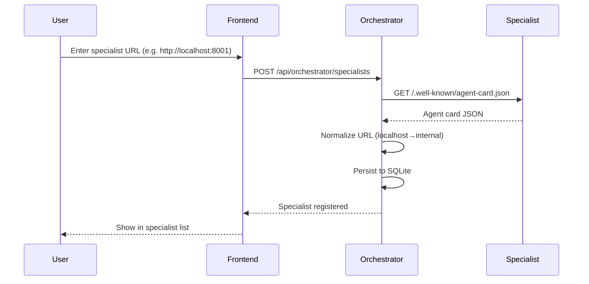
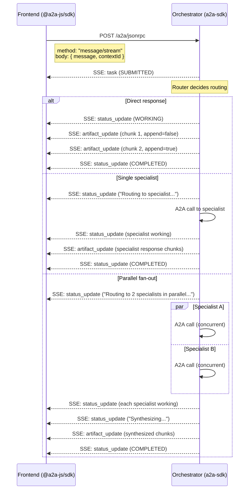

# A2A Protocol Guide

The **Agent-to-Agent (A2A) protocol** is an open standard for agent interoperability. Nimbus Chat uses the A2A Python SDK (`a2a-sdk`) on the backend and the A2A JavaScript SDK (`@a2a-js/sdk`) on the frontend.

---

## Core Concepts

### Agent Card

Every A2A agent publishes a machine-readable **agent card** at `/.well-known/agent-card.json`. This is how agents discover each other's capabilities.

```json
{
  "name": "Nimbus Travel Planner",
  "description": "A travel-planning specialist...",
  "version": "0.1.0",
  "capabilities": {
    "streaming": true,
    "push_notifications": false
  },
  "supported_interfaces": [
    {
      "url": "http://travel-specialist:8001/a2a/jsonrpc",
      "protocol_binding": "JSONRPC",
      "protocol_version": "1.0"
    },
    {
      "url": "http://travel-specialist:8001/a2a",
      "protocol_binding": "HTTP+JSON",
      "protocol_version": "1.0"
    }
  ],
  "skills": [
    {
      "id": "itinerary_creation",
      "name": "Itinerary creation",
      "description": "Builds day-by-day itineraries...",
      "tags": ["travel", "itinerary"],
      "examples": ["Plan a 4-day Tokyo itinerary for first-time visitors."]
    }
  ]
}
```

### Protocol Bindings

Nimbus Chat supports two bindings:

| Binding | URL Path | Use Case |
|---|---|---|
| **JSONRPC** | `/a2a/jsonrpc` | Primary — supports streaming via SSE |
| **HTTP+JSON** | `/a2a` | REST fallback — single request/response |

### Task Lifecycle



### Event Types

The A2A streaming protocol emits these event types via SSE:

| Event | Protobuf Field | Description |
|---|---|---|
| **Task** | `task` | Task created with initial state |
| **Status Update** | `status_update` | State transition (working, completed, failed) + optional message |
| **Artifact Update** | `artifact_update` | Streamed response chunk (supports `append` for incremental) |
| **Message** | `message` | Final complete message |

---

## A2A in Nimbus Chat

### Registration Flow



### URL Normalization

The frontend registers specialists using **localhost URLs** (e.g. `http://localhost:8001`), but the orchestrator runs inside Docker and needs **internal service URLs** (e.g. `http://travel-specialist:8001`). The registry handles this via `SPECIALIST_URL_REMAPS`:

```
SPECIALIST_URL_REMAPS=http://localhost:8001=http://travel-specialist:8001,http://localhost:8002=http://nutrition-specialist:8002
```

### Streaming Message Flow



### Frontend A2A Client

The frontend uses the `@a2a-js/sdk` to create a client and stream messages:

```typescript
import { ClientFactory, type Client } from '@a2a-js/sdk/client'

const clientFactory = new ClientFactory()
const client = await clientFactory.createFromUrl('http://localhost:8000')

// Stream a message
const stream = client.sendMessageStream({
  message: {
    messageId: uuid(),
    role: 1, // USER
    contextId: conversationId,
    parts: [{ content: { $case: 'text', value: userMessage } }],
  },
})

for await (const event of stream) {
  switch (event.payload?.$case) {
    case 'task':           // Task created
    case 'statusUpdate':   // Status change (routing, working, completed)
    case 'artifactUpdate': // Streamed response chunk
    case 'message':        // Final message
  }
}
```

### Backend A2A Server

The backend uses `a2a-sdk` to mount A2A routes on FastAPI:

```python
from a2a.server.routes.fastapi_routes import add_a2a_routes_to_fastapi
from a2a.server.routes.jsonrpc_routes import create_jsonrpc_routes
from a2a.server.routes.rest_routes import create_rest_routes
from a2a.server.routes.agent_card_routes import create_agent_card_routes

add_a2a_routes_to_fastapi(
    app,
    agent_card_routes=create_agent_card_routes(agent_card),
    jsonrpc_routes=create_jsonrpc_routes(request_handler, rpc_url='/a2a/jsonrpc'),
    rest_routes=create_rest_routes(request_handler, path_prefix='/a2a'),
)
```

The `DefaultRequestHandler` ties together the executor, task store, and agent card:

```python
request_handler = DefaultRequestHandler(
    agent_executor=executor,        # OrchestratorExecutor or GenericSpecialistExecutor
    task_store=DatabaseTaskStore(engine),
    agent_card=agent_card,
    push_config_store=push_config_store,
)
```

---

## Artifact Streaming Details

A2A artifacts support **incremental append**. The first chunk must use `append=False` to create the artifact, and subsequent chunks use `append=True`:

```python
first_chunk = True
async for token in agent.astream_events(...):
    await updater.add_artifact(
        artifact_id=artifact_id,
        name='travel-plan',
        parts=[Part(text=token)],
        append=not first_chunk,  # False for first, True for rest
        last_chunk=False,
    )
    first_chunk = False
```

This allows the frontend to render text as it streams in, rather than waiting for the complete response.

---

## Context IDs and Threading

The A2A `context_id` field is used as the LangGraph `thread_id` across the system:

| Component | Thread ID | Purpose |
|---|---|---|
| Router agent | `{contextId}:route` | Routing decision history |
| Responder agent | `{contextId}:respond` | Direct response history |
| Synthesizer agent | `{contextId}:synthesize` | Synthesis history |
| Travel specialist | `{contextId}:travel_specialist` | Travel conversation history |
| Nutrition specialist | `{contextId}:nutrition_specialist` | Nutrition conversation history |

The frontend generates a stable UUID per conversation and sends it as `contextId` on every message. This enables multi-turn conversations with full context retention.
