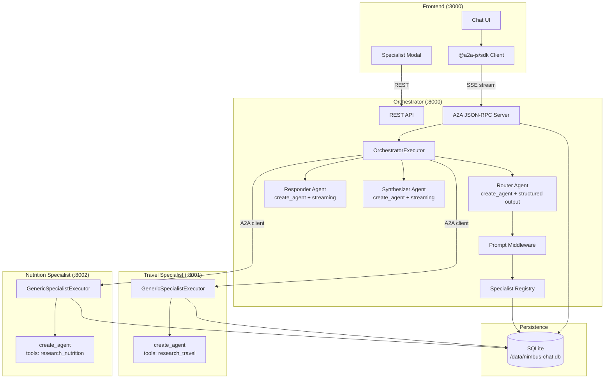
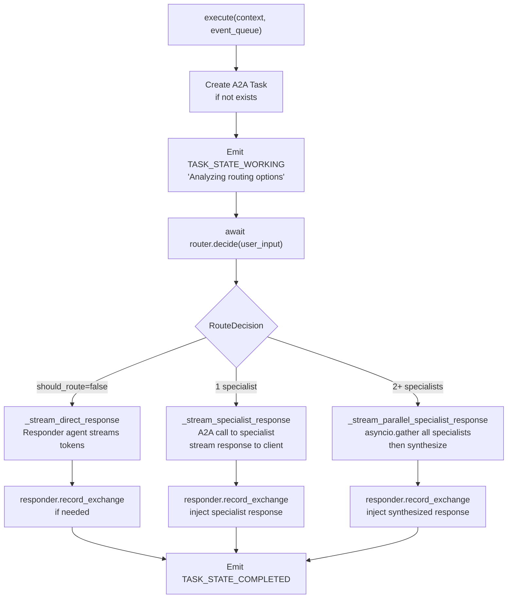
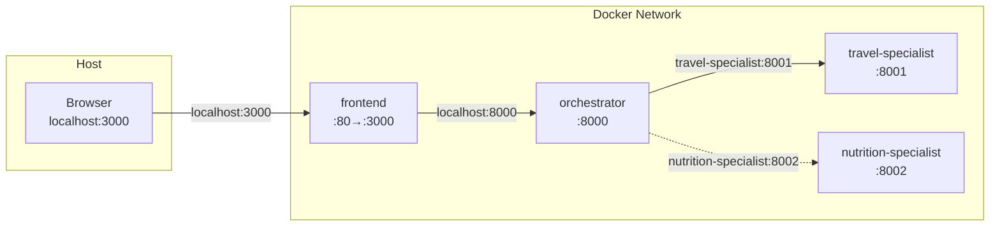

# Architecture Deep Dive

## Overview

Nimbus Chat is a multi-agent system built on the A2A (Agent-to-Agent) protocol. It consists of four services orchestrated via Docker Compose:

| Service | Port | Role |
|---|---|---|
| **Frontend** | 3000 | React SPA — chat UI, specialist management, conversation history |
| **Orchestrator** | 8000 | A2A server + router + responder + synthesizer + specialist registry |
| **Travel Specialist** | 8001 | A2A server + LangChain agent with Tavily research tool |
| **Nutrition Specialist** | 8002 | A2A server + LangChain agent with Tavily research tool |

All backend services share a SQLite database via a Docker volume for task persistence and LangGraph checkpointing.

---

## Component Diagram



---

## Orchestrator Internals

### The OrchestratorExecutor

The `OrchestratorExecutor` implements the A2A `AgentExecutor` interface. Its `execute()` method is the entry point for every user message:



### Three LangChain Agents

The orchestrator runs three separate `create_agent` instances, each with its own LangGraph thread namespace:

| Agent | Thread ID | Purpose |
|---|---|---|
| **Router** | `{contextId}:route` | Structured output — returns `RouteDecision` with specialist list |
| **Responder** | `{contextId}:respond` | Direct responses when no specialist is needed |
| **Synthesizer** | `{contextId}:synthesize` | Combines multiple specialist responses into one |

All three share the same SQLite checkpointer, so conversation history persists across restarts.

### Router Agent

The router uses `create_agent` with `response_format=RouteDecision` (a Pydantic model):

```python
class RouteDecision(BaseModel):
    should_route: bool
    specialists: list[SpecialistRoute]  # 0, 1, or many
    rationale: str
```

The `RegisteredSpecialistPromptMiddleware` injects a formatted list of all registered specialists (with their skills, tags, examples) into the router's system prompt before each call. The router then decides which specialists are relevant.

### Specialist Prompt Middleware

```python
class RegisteredSpecialistPromptMiddleware(AgentMiddleware):
    async def awrap_model_call(self, request, call_next):
        fragment = await registry.render_prompt_fragment()
        # Inject specialist info into the system message
        request.messages[0].content += "\n\n" + fragment
        return await call_next(request)
```

This ensures the router always has up-to-date information about available specialists.

---

## Specialist Framework

### GenericSpecialistExecutor

All specialists share the same executor code — only the `SpecialistConfig` differs:

```python
@dataclass
class SpecialistConfig:
    name: str
    description: str
    system_prompt: str
    skills: list[SpecialistSkillSpec]
    tavily_tool_name: str
    tavily_tool_description: str
    table_name_prefix: str  # e.g. "travel_specialist"
    artifact_name: str      # e.g. "travel-plan"
```

The executor:
1. Creates a task from the user message (`new_task_from_user_message`)
2. Emits a "received" status update
3. Streams the LangChain agent's output as artifact chunks
4. Emits a completion status

### Tavily Research Tool

Each specialist gets a LangChain `StructuredTool` wrapping Tavily search:

```python
def build_tavily_research_tool(settings, *, tool_name, tool_description):
    def _search(query: str) -> str:
        client = TavilyClient(api_key=settings.tavily_api_key)
        response = client.search(query=query, max_results=5, include_answer=True)
        # Format results...
        return formatted

    return StructuredTool.from_function(
        func=_search,
        name=tool_name,
        description=tool_description,
    )
```

The tool is passed to `create_agent(tools=[...])`, so the LLM can decide when to search the web.

---

## Data Persistence

### SQLite Tables


- **`specialists`** — Registered specialist agents with cached agent cards
- **`tasks` / `travel_specialist_tasks` / `nutrition_specialist_tasks`** — A2A task lifecycle (one table per specialist to avoid conflicts)
- **`checkpoints` + `writes`** — LangGraph checkpoint state for all agents

---

## Docker Networking



The orchestrator uses **internal Docker hostnames** (`travel-specialist:8001`, `nutrition-specialist:8002`) to reach specialists. The frontend uses **localhost** ports to reach the orchestrator. The `SPECIALIST_URL_REMAPS` setting translates public localhost URLs (that the frontend registers) to internal Docker URLs (that the orchestrator uses for routing).
