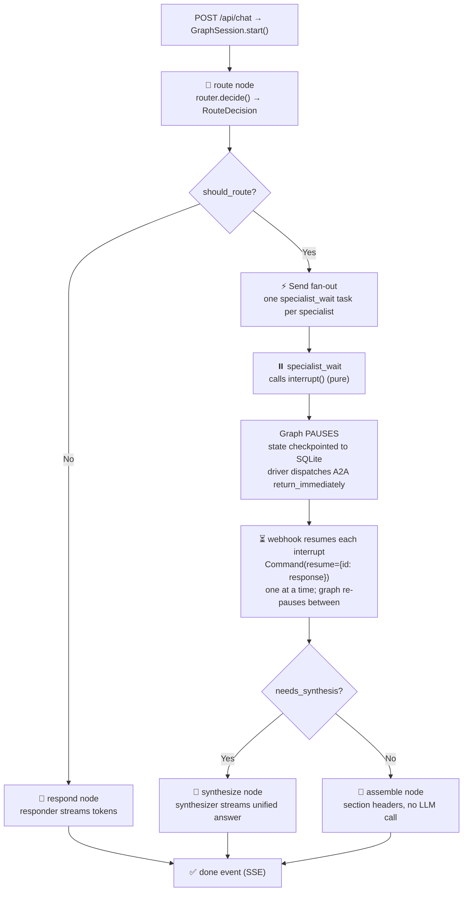
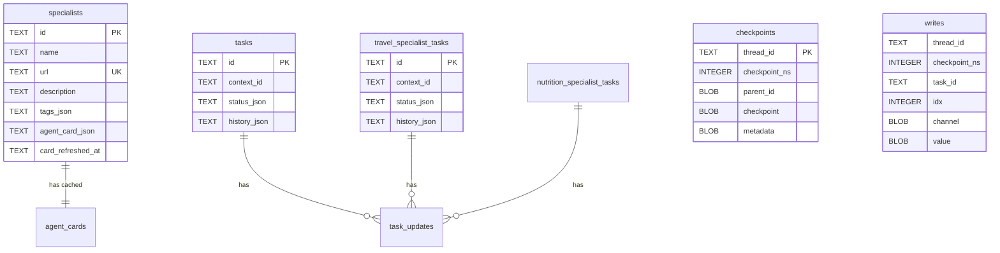
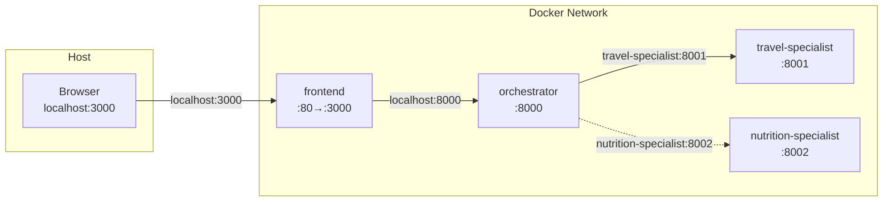

# Architecture Deep Dive

## Overview

Nimbus Chat is a multi-agent system built on the A2A (Agent-to-Agent) protocol. It consists of four services orchestrated via Docker Compose:

| Service | Port | Role |
|---|---|---|
| **Frontend** | 3000 | React SPA (plain SSE client, no A2A SDK) — chat UI, specialist management, conversation history |
| **Orchestrator** | 8000 | LangGraph StateGraph + FastAPI — router/responder/synthesizer + specialist registry + SSE endpoint + push-notification webhook |
| **Travel Specialist** | 8001 | A2A server + LangChain agent with Tavily research tool |
| **Nutrition Specialist** | 8002 | A2A server + LangChain agent with Tavily research tool |

All backend services share a SQLite database via a Docker volume for task persistence and LangGraph checkpointing.

---

## Component Diagram

```mermaid
graph TB
    subgraph "Frontend (:3000)"
        UI[Chat UI]
        Modal[Specialist Modal]
        SSEClient["Plain SSE Client<br/>fetch POST /api/chat"]
    end

    subgraph "Orchestrator (:8000)"
        API[REST API]
        SSE["POST /api/chat (SSE)"]
        Webhook["POST /a2a/callback"]
        Graph["LangGraph StateGraph"]
        Driver["GraphSession driver"]
        Router["Router Agent<br/>create_agent + structured output"]
        Responder["Responder Agent<br/>create_agent + streaming"]
        Synthesizer["Synthesizer Agent<br/>create_agent + streaming"]
        Registry[Specialist Registry]
        MW[Prompt Middleware]
    end

    subgraph "Travel Specialist (:8001)"
        TSExec[GenericSpecialistExecutor]
        TSAgent["create_agent<br/>tools: research_travel"]
    end

    subgraph "Nutrition Specialist (:8002)"
        NSExec[GenericSpecialistExecutor]
        NSAgent["create_agent<br/>tools: research_nutrition"]
    end

    subgraph "Persistence"
        SQLite[("SQLite<br/>checkpoints + memory")]
    end

    UI --> SSEClient
    SSEClient -->|SSE stream| SSE
    Modal -->|REST| API

    SSE --> Driver
    Driver --> Graph
    Graph --> Router
    Graph --> Responder
    Graph --> Synthesizer
    Router --> MW
    MW --> Registry

    Driver -->|A2A return_immediately| TSExec
    Driver -->|A2A return_immediately| NSExec
    TSExec -->|push notifications| Webhook
    NSExec -->|push notifications| Webhook
    Webhook -->|Command(resume)| Driver
    TSExec --> TSAgent
    NSExec --> NSAgent

    Registry --> SQLite
    Graph --> SQLite
    TSExec --> SQLite
    NSExec --> SQLite
```

---

## Orchestrator Internals

The orchestrator is a **LangGraph `StateGraph`** (see `graph.py`) checkpointed to SQLite, driven by a per-request **`GraphSession`** (see `session.py`). It is **not** an A2A server — it exposes a plain FastAPI SSE endpoint (`POST /api/chat`) and a push-notification webhook (`POST /a2a/callback`).

### The StateGraph



**Nodes:**

| Node | Role |
|---|---|
| `route` | Calls the router agent (structured output). Fans out via `Send` or routes to `respond`. |
| `respond` | Responder agent streams a direct answer (no specialist). |
| `specialist_wait` | **Pure `interrupt()`** — no side effects before the call (LangGraph re-runs nodes on resume). The interrupt payload carries specialist name/url/query for the driver. |
| `synthesize` | Synthesizer agent streams a unified answer from multiple specialist responses. |
| `assemble` | Concatenates specialist responses with `## Specialist Name` headers — no LLM call. |

> **Why the `specialist_wait` node is pure:** LangGraph re-runs a node from the top when its interrupt is resumed. If the A2A `send_message` lived inside the node, it would fire twice. So the node only calls `interrupt()`; the driver sends the A2A request *after* the graph pauses.

### The GraphSession driver loop

Each `/api/chat` request creates a `GraphSession` that owns an `asyncio.Queue` of SSE events and a `resume_queue` of `Command(resume=...)` objects. The driver:

```mermaid
sequenceDiagram
    participant FE as Frontend (SSE)
    participant D as Driver (GraphSession)
    participant G as StateGraph
    participant S as Specialist
    participant WH as Webhook

    FE->>D: POST /api/chat
    D->>G: astream(input, stream_mode=[updates,custom])
    G-->>D: route node runs → fan-out → interrupt()
    Note over G: PAUSED (SQLite checkpoint)
    D->>S: SendMessage(return_immediately=true, push_config)
    S-->>D: 200 OK
    D-->>FE: status events (routing, working)

    S->>WH: POST /a2a/callback (chunks)
    WH-->>FE: specialist_chunk events (activity trail)
    S->>WH: POST /a2a/callback (COMPLETED)
    WH->>D: resume_queue.put(Command(resume={id: resp}))
    D->>G: astream(Command(resume=...))
    Note over G: branch resumes; re-pauses if other interrupts pending
    G-->>D: (repeats per specialist) → synthesize/assemble → END
    D-->>FE: token events (streamed answer) + done
```

1. Run `graph.astream(input, config, stream_mode=['updates','custom'])`; relay `custom` events (status/token from `get_stream_writer`) to the SSE queue.
2. When the stream ends, inspect `graph.aget_state()`. If there are pending interrupts → for each *new* interrupt, register a callback token and fire `SendMessage(return_immediately=True)` with a push config. Then `await resume_queue.get()`.
3. The webhook pushes `Command(resume={interrupt_id: response})` as each specialist completes. Each resume drives another `astream` iteration. With multiple specialists, the graph resumes one branch and **re-pauses** (partial resume of multiple interrupts) until all are done.
4. When no interrupts remain, the graph reaches `END`; the driver emits `done` and records the exchange into the responder's thread for continuity.

### Three LangChain Agents

The orchestrator runs three separate `create_agent` instances (called from inside graph nodes), each with its own LangGraph thread namespace for conversation memory:

| Agent | Thread ID | Purpose |
|---|---|---|
| **Router** | `{contextId}:route` | Structured output — returns `RouteDecision` with specialist list + `needs_synthesis` flag |
| **Responder** | `{contextId}:respond` | Direct responses when no specialist is needed |
| **Synthesizer** | `{contextId}:synthesize` | Combines multiple specialist responses into one (only when `needs_synthesis=true`) |

The **parent orchestrator graph** uses a fresh thread per turn (`{contextId}:orch:{turn_id}`) so each turn's state is isolated; conversation memory lives in the nested agents.

### Router Agent

The router uses `create_agent` with `response_format=RouteDecision` (a Pydantic model):

```python
class RouteDecision(BaseModel):
    should_route: bool
    specialists: list[SpecialistRoute]  # 0, 1, or many
    needs_synthesis: bool               # only when 2+ specialists
    rationale: str
```

The `RegisteredSpecialistPromptMiddleware` injects a formatted list of all registered specialists (with their skills, tags, examples) into the router's system prompt before each call.

### Specialist Prompt Middleware

```python
class RegisteredSpecialistPromptMiddleware(AgentMiddleware):
    async def awrap_model_call(self, request, call_next):
        fragment = await registry.render_prompt_fragment()
        # Inject specialist info into the system message
        request.messages[0].content += "\n\n" + fragment
        return await call_next(request)
```

This ensures the router always has up-to-date information about available specialists.

---

## Specialist Framework

### GenericSpecialistExecutor

All specialists share the same executor code — only the `SpecialistConfig` differs:

```python
@dataclass
class SpecialistConfig:
    name: str
    description: str
    system_prompt: str
    skills: list[SpecialistSkillSpec]
    tavily_tool_name: str
    tavily_tool_description: str
    table_name_prefix: str  # e.g. "travel_specialist"
    artifact_name: str      # e.g. "travel-plan"
```

The executor:
1. Creates a task from the user message (`new_task_from_user_message`)
2. Emits a "received" status update
3. Streams the LangChain agent's output as artifact chunks
4. Emits a completion status

### Tavily Research Tool

Each specialist gets a LangChain `StructuredTool` wrapping Tavily search:

```python
def build_tavily_research_tool(settings, *, tool_name, tool_description):
    def _search(query: str) -> str:
        client = TavilyClient(api_key=settings.tavily_api_key)
        response = client.search(query=query, max_results=5, include_answer=True)
        # Format results...
        return formatted

    return StructuredTool.from_function(
        func=_search,
        name=tool_name,
        description=tool_description,
    )
```

The tool is passed to `create_agent(tools=[...])`, so the LLM can decide when to search the web.

---

## Data Persistence

### SQLite Tables



- **`specialists`** — Registered specialist agents with cached agent cards
- **`tasks` / `travel_specialist_tasks` / `nutrition_specialist_tasks`** — A2A task lifecycle (one table per specialist to avoid conflicts)
- **`checkpoints` + `writes`** — LangGraph checkpoint state for all agents

---

## Docker Networking



The orchestrator uses **internal Docker hostnames** (`travel-specialist:8001`, `nutrition-specialist:8002`) to reach specialists. The frontend uses **localhost** ports to reach the orchestrator. The `SPECIALIST_URL_REMAPS` setting translates public localhost URLs (that the frontend registers) to internal Docker URLs (that the orchestrator uses for routing).
