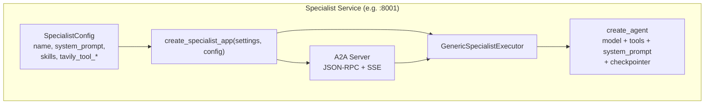

# Specialists Guide

Nimbus Chat uses a **generic specialist framework** that makes it trivial to add new domain-specific agents. Every specialist shares the same executor, app factory, and Tavily integration — only the configuration differs.

---

## How Specialists Work



### SpecialistConfig

```python
@dataclass
class SpecialistConfig:
    name: str                           # "Nimbus Travel Planner"
    description: str                    # Agent card description
    version: str                        # "0.1.0"
    system_prompt: str                  # LangChain create_agent system prompt
    skills: list[SpecialistSkillSpec]   # A2A agent card skills
    tavily_tool_name: str               # LangChain tool name (e.g. "research_travel")
    tavily_tool_description: str        # Tool docstring for LLM
    table_name_prefix: str              # SQLite table prefix (e.g. "travel_specialist")
    artifact_name: str                 # A2A artifact name (e.g. "travel-plan")
    agent_name_label: str              # Display name for status messages
```

### SpecialistSkillSpec

```python
@dataclass
class SpecialistSkillSpec:
    id: str               # "itinerary_creation"
    name: str             # "Itinerary creation"
    description: str      # What this skill does
    tags: list[str]       # ["travel", "itinerary"]
    examples: list[str]   # ["Plan a 4-day Tokyo itinerary..."]
```

---

## Existing Specialists

### Travel Planner (port 8001)

| Property | Value |
|---|---|
| Name | Nimbus Travel Planner |
| Table prefix | `travel_specialist` |
| Artifact name | `travel-plan` |
| Tavily tool | `research_travel` |
| Skills | Destination planning, Itinerary creation, Budget travel advice, Activity recommendations |

### Nutritionist (port 8002)

| Property | Value |
|---|---|
| Name | Nimbus Nutritionist |
| Table prefix | `nutrition_specialist` |
| Artifact name | `nutrition-plan` |
| Tavily tool | `research_nutrition` |
| Skills | Meal planning, Macro/calorie guidance, Dietary condition management, Nutrient education |

---

## Adding a New Specialist

### Step 1: Create the config

In `backend/app/specialist/configs.py`:

```python
from app.specialist.builder import SpecialistConfig, SpecialistSkillSpec

finance_config = SpecialistConfig(
    name='Nimbus Finance Advisor',
    description='A personal finance specialist for budgeting, investing, and financial planning.',
    system_prompt=(
        'You are Nimbus Finance Advisor, a certified financial planner. '
        'Provide evidence-based financial guidance. Structure responses with '
        'clear sections. Use the research tool for current market data, rates, '
        'and financial news. Always include a disclaimer that this is not '
        'professional financial advice.'
    ),
    tavily_tool_name='research_finance',
    tavily_tool_description=(
        'Search the web for current market data, interest rates, financial news, '
        'and investment research.'
    ),
    table_name_prefix='finance_specialist',
    artifact_name='finance-plan',
    agent_name_label='Finance Advisor',
    skills=[
        SpecialistSkillSpec(
            id='budgeting',
            name='Budget planning',
            description='Creates personalized budgets based on income, expenses, and goals.',
            tags=['finance', 'budget', 'planning'],
            examples=[
                'Create a monthly budget for $5,000 income',
                'How much should I save each month for a house deposit?',
            ],
        ),
        SpecialistSkillSpec(
            id='investing',
            name='Investment guidance',
            description='Recommends investment strategies based on risk tolerance and goals.',
            tags=['finance', 'investing', 'stocks'],
            examples=[
                'What is a good passive index fund portfolio?',
                'How should I allocate my 401k?',
            ],
        ),
    ],
)

# Register in the config map
SPECIALIST_CONFIGS['finance'] = finance_config
```

### Step 2: Add Docker Compose service

In `docker-compose.yml`:

```yaml
finance-specialist:
  build:
    context: ./backend
    dockerfile: Dockerfile
  command: ["uv", "run", "python", "specialist_main.py"]
  environment:
    OPENROUTER_API_KEY: ${OPENROUTER_API_KEY:-}
    SQLITE_PATH: /data/nimbus-chat.db
    SPECIALIST_HOST: 0.0.0.0
    SPECIALIST_PORT: 8003
    SPECIALIST_TYPE: finance
    SPECIALIST_PUBLIC_URL: http://localhost:8003
    SPECIALIST_INTERNAL_URL: http://finance-specialist:8003
    TAVILY_ENABLED: ${TAVILY_ENABLED:-true}
    TAVILY_API_KEY: ${TAVILY_API_KEY:-}
    CORS_ORIGINS: ${CORS_ORIGINS:-*}
  ports:
    - "8003:8003"
  volumes:
    - backend-data:/data
```

### Step 3: Update URL remaps

In the `orchestrator` service's environment, add the new remap:

```yaml
SPECIALIST_URL_REMAPS: >-
  http://localhost:8001=http://travel-specialist:8001,
  http://localhost:8002=http://nutrition-specialist:8002,
  http://localhost:8003=http://finance-specialist:8003
```

### Step 4: Launch & register

```bash
docker compose up -d --build finance-specialist
```

Register via the UI at `http://localhost:8003` or via API:

```bash
curl -X POST http://localhost:8000/api/orchestrator/specialists \
  -H 'Content-Type: application/json' \
  -d '{"name":"Nimbus Finance Advisor","url":"http://localhost:8003","description":"Finance","tags":["finance"],"notes":""}'
```

The router will automatically consider the new specialist for finance-related queries.

---

## Tavily Integration

Each specialist gets a Tavily-powered LangChain tool. The tool is a `StructuredTool` that the LLM can call autonomously:

```python
# In GenericSpecialistExecutor._get_tools()
def _get_tools(self):
    tools = []
    if self.settings.tavily_configured:
        tools.append(build_tavily_research_tool(
            self.settings,
            tool_name=self.config.tavily_tool_name,
            tool_description=self.config.tavily_tool_description,
        ))
    return tools
```

When Tavily is not configured, the tool is simply omitted — the specialist still works, just without web research.

---

## How Routing Works

The orchestrator's router agent receives the injected specialist cards (via `RegisteredSpecialistPromptMiddleware`) and produces a `RouteDecision`:

```python
class RouteDecision(BaseModel):
    should_route: bool
    specialists: list[SpecialistRoute]  # name, url, rationale
    rationale: str
```

The router is instructed to select:
- **0 specialists** → orchestrator responds directly
- **1 specialist** → response streams directly from that specialist
- **2+ specialists** → parallel fan-out + synthesis

The decision is based on the specialist's skills, tags, and examples — so well-crafted `SpecialistSkillSpec` entries directly improve routing accuracy.
